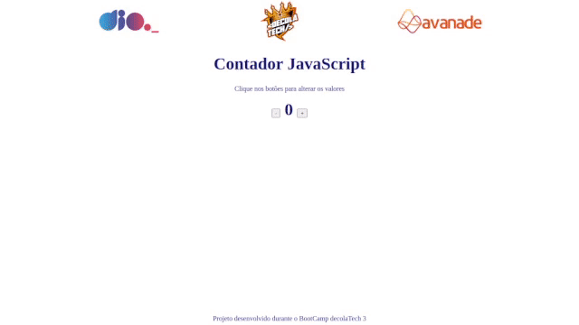
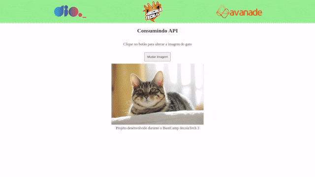
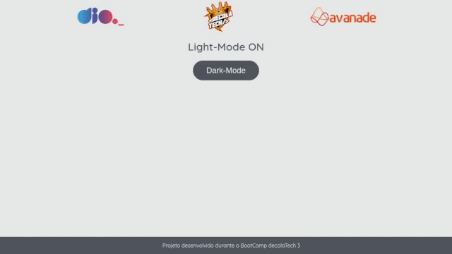

# BootCamp DecolaTech 3ª Edição  

## Repositório do BootCamp DecolaTech 3ª Edição - DIO e Avanade

Este repositório é um projeto do bootcamp da DIO para compartillhar conhecimentos adquiridos neste programa

### Projetos desenvolvidos neste bootcamp:

| Projeto Contador com JavaScript | Projeto Consumindo API com JavaScript | Projeto Dark-Mode com JavaScript
|:----------:|:---------:|:---------:|
|  |   | 

#
### Links úteis:

[O que é BLOB e como funciona?](./aulas/Blob.md)
